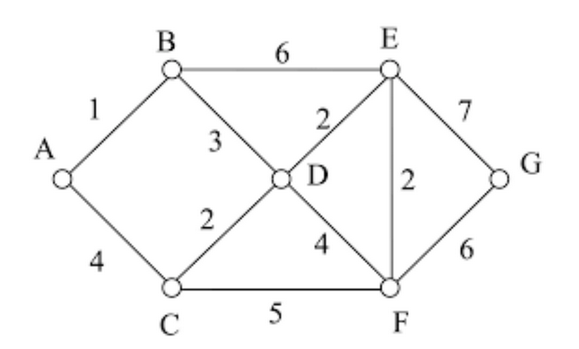

# Assignment 3 - Travelling Salesman Problem

## Instructions for execution
1. change to current working directory to **Assignment3**

```bash
cd Assignment3
```
2. Run the python file
```bash
python tsp.py
```

## Tasks
    1. Implement the Travelling Salesman Problem for graph shown below.
    2. Print minimum traversal path and total cost of the path.




## Final Output

    Minimum path :  A -> C -> F -> G -> E -> D -> B -> A
    Minimum path length :  28

